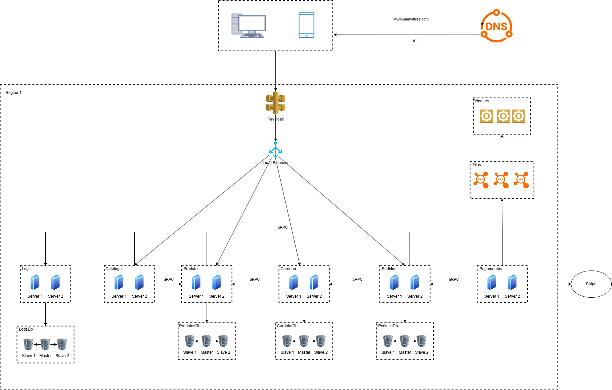

# 🛒 Market Free – API Backend com Microserviços

[]()
[]()

Projeto backend acadêmico de um sistema e-commerce construído com **arquitetura de microserviços**, focado em escalabilidade, modularidade e boas práticas modernas de engenharia de software. Desenvolvido para fins educacionais, mas com estrutura profissional orientada a produção.

---

## 📁 Estrutura do Repositório

```bash
📦 market-free-backend/
├── 📂 requisitos/             # Documentos de requisitos (Word e PDF)
│   └── Documento_de_Requisitos_Market_Free.pdf
├── 📂 arquitetura/            # Diagramas e imagens da arquitetura
│   └── Arquitetura.jpg

```

---

## 📌 Objetivo

> Criar uma aplicação backend distribuída, modular e observável, com microserviços que atendam funcionalidades essenciais de um sistema de e-commerce, aplicando conceitos vistos em aula como: autenticação, orquestração com Kubernetes, rastreamento distribuído, uso de gRPC, entre outros.

---

## ⚙️ Tecnologias Utilizadas

- **Linguagem:** Node.js
- **Orquestração:** Kubernetes
- **Logs:** MongoDB + Logger customizado
- **Observabilidade:** Prometheus
- **Autenticação:** JWT + Autenticação mútua com gRPC
- **Comunicação entre serviços:** HTTP + gRPC
- **Containerização:** Docker

---

## 🧩 Microserviços

| Serviço        | Descrição                                       |
|----------------|-------------------------------------------------|
| `catalogo`     | Catálogo de produtos                            |
| `produtos`     | Gerenciamento de produtos e categorias          |
| `carrinho`     | Carrinho de compras persistente por sessão      |
| `pedidos`      | Geração e histórico de pedidos                  |
| `pagamentos`   | Integração com gateway simulado de pagamento    |
| `logs`         | Serviço centralizado de logs em MongoDB         |

---

## 📄 Documentação

- 📘 [Documento de Requisitos (PDF)](./requisitos/Documento_de_Requisitos_Market_Free.pdf)
- 🧠 [Imagem da Arquitetura](./arquitetura/Arquitetura.jpg)

> Outras documentações técnicas e arquivos de configuração serão adicionados nesta seção conforme o desenvolvimento evolui.


## 🛡️ Autenticação

- JWT para autenticação de usuários
- Tokens com escopo para controle de acesso entre serviços

---

## 📊 Observabilidade

- 📈 **Métricas Prometheus**: cada serviço expõe suas métricas via endpoint `/metrics`
- 📉 **Grafana Dashboard**: dashboards prontos para análise de performance
- 🔍 **OpenTelemetry + Logs**: rastreamento distribuído entre serviços

---

## 🧱 Arquitetura

- 🧭 **Estilo arquitetural:** Microserviços independentes comunicando-se via HTTP e gRPC
- 📡 **Gateway de API:** Controla a entrada externa e roteia para os serviços internos
- 🔐 **Segurança:** JWT + autenticação mútua entre microserviços
- 🔁 **Escalabilidade:** Cada serviço pode ser escalado independentemente via Kubernetes
- 📦 **Containers:** Todos os serviços são conteinerizados com Docker

### 📌 Diagrama da Arquitetura



> O diagrama representa os principais componentes do sistema, sua comunicação e responsabilidades.

---

## 📝 Licença

Este projeto está sob a licença [MIT](./LICENSE).
